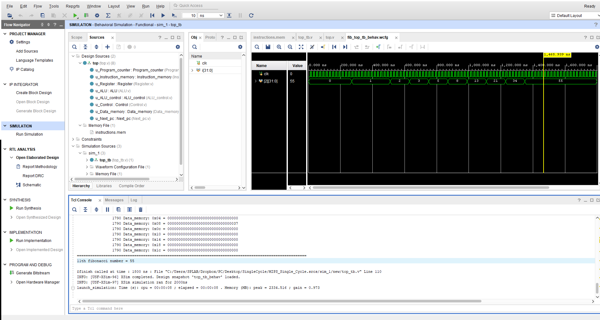

# MIPS (RISC) 32 bits Single Cycle Processor

## Overview

MIPS Project using **Verilog** in **Xilinx-VIVADO**.

## Block Diagram

[MIPS](Documents/MIPS.png)


<center>Figure: Single Cycle Diagram (MIPS)</center>

## RTL

[RTL](Documents/RTL.png)

<center>Figure: RTL Diagram (MIPS)</center>

## ALU Control

[ALU_Control](Documents/ALU_Control.png)


<center>Figure: ALU Control Table</center>


## Control Unit

[Control_Unit](Documents/Control_Unit.png)


<center>Figure: Control Unit Table</center>

## Verilog Simulation

A set of instructions are used to test the single-cycle implementation.

# Testcase: 

## Fibonacci intructions 

```assembly

001000_00000_01000_0000000000001010 //addi $t0, $zero, 10 [fib]
001000_00000_01001_0000000000000001 //addi $t1, $zero, 1
001000_00000_01010_1111111111111111 //addi $t2, $zero, -1
000100_01000_00000_0000000000000101 //beq $t0, $zero, end [loop]
000000_01001_01010_01001_00000_100000 //add $t1, $t1, $t2
000000_01001_01010_01010_00000_100010 //sub $t2, $t1, $t2
001000_01000_01000_1111111111111111 //addi $t0, $t0, -1
000010_00000000000000000000000011 // j loop
101011_00000_01001_0000000011111111 // sw $t1, 255($zero) [end]

```

## Simulation result:


<center>Figure: Fibonacci Simulation</center>


## LW SW intructions 

```assembly

001000_00000_01000_0000000000100001 //addi $t0, $zero, 0x21 // 21H = d 33
001000_00000_01001_0000000000111001 //addi $t1, $zero, 0x39 // 37H = d 57
111111_00000000000000000000000000 //nop
111111_00000000000000000000000000 //nop
111111_00000000000000000000000000 //nop
111111_00000000000000000000000000 //nop
111111_00000000000000000000000000 //nop
101011_00000_01001_0000000000001000 //sw $t1, 8($zero) // Dmem[$zero + 8] = 37H
100011_00000_10001_0000000000001000 //lw $s1, 8($zero) // $s1 = Dmem[$zero + 8] // $s1 = 37H
111111_00000000000000000000000000 //nop

```

## Simulation result:

```c
# run 1000ns
                  10 PC =          0
                  10 IM = 11111100000000000000000000000000
                  10 ALU_control = 0010
                  10 ALU_Result = 0x00000000
                  10 ALUOp = 00
                  10 ALU_In1 = 0x00000000
                  10 Alu_In2 = 0x00000000
                  10 WB = 0x00000000
                  10 MemRead = 0
                  10 MemWrite = 0
========================================================================================================
                  10 R0(r0) = 0x00000000, R8 (t0) = 0x00000000, R16(s0) = 0x00000000, R24(t8) = 0x00000000
                  10 R1(at) = 0x00000000, R9 (t1) = 0x00000000, R17(s1) = 0x00000000, R25(t9) = 0x00000000
                  10 R2(v0) = 0x00000000, R10(t2) = 0x00000000, R18(s2) = 0x00000000, R26(k0) = 0x00000000
                  10 R3(v1) = 0x00000000, R11(t3) = 0x00000000, R19(s3) = 0x00000000, R27(k1) = 0x00000000
                  10 R4(a0) = 0x00000000, R12(t4) = 0x00000000, R20(s4) = 0x00000000, R28(gp) = 0x00000000
                  10 R5(a1) = 0x00000000, R13(t5) = 0x00000000, R21(s5) = 0x00000000, R29(sp) = 0x00000000
                  10 R6(a2) = 0x00000000, R14(t6) = 0x00000000, R22(s6) = 0x00000000, R30(s8) = 0x00000000
                  10 R7(a3) = 0x00000000, R15(t7) = 0x00000000, R23(s7) = 0x00000000, R31(ra) = 0x00000000
---------------------------------------------------------------------------------------------------------
                  10 Data_memory: 0x00 = 00000000000000000000000000000000
                  10 Data_memory: 0x04 = 00000000000000000000000000000000
                  10 Data_memory: 0x08 = 00000000000000000000000000000000
                  10 Data_memory: 0x0c = 00000000000000000000000000000000
                  10 Data_memory: 0x10 = 00000000000000000000000000000000
                  10 Data_memory: 0x14 = 00000000000000000000000000000000
                  10 Data_memory: 0x18 = 00000000000000000000000000000000
                  10 Data_memory: 0x1c = 00000000000000000000000000000000
========================================================================================================
                  30 PC =          4
                  30 IM = 00100000000010000000000000100001
                  30 ALU_control = 0010
                  30 ALU_Result = 0x00000021
                  30 ALUOp = 00
                  30 ALU_In1 = 0x00000000
                  30 Alu_In2 = 0x00000000
                  30 WB = 0x00000021
                  30 MemRead = 0
                  30 MemWrite = 0
========================================================================================================
                  30 R0(r0) = 0x00000000, R8 (t0) = 0x00000000, R16(s0) = 0x00000000, R24(t8) = 0x00000000
                  30 R1(at) = 0x00000000, R9 (t1) = 0x00000000, R17(s1) = 0x00000000, R25(t9) = 0x00000000
                  30 R2(v0) = 0x00000000, R10(t2) = 0x00000000, R18(s2) = 0x00000000, R26(k0) = 0x00000000
                  30 R3(v1) = 0x00000000, R11(t3) = 0x00000000, R19(s3) = 0x00000000, R27(k1) = 0x00000000
                  30 R4(a0) = 0x00000000, R12(t4) = 0x00000000, R20(s4) = 0x00000000, R28(gp) = 0x00000000
                  30 R5(a1) = 0x00000000, R13(t5) = 0x00000000, R21(s5) = 0x00000000, R29(sp) = 0x00000000
                  30 R6(a2) = 0x00000000, R14(t6) = 0x00000000, R22(s6) = 0x00000000, R30(s8) = 0x00000000
                  30 R7(a3) = 0x00000000, R15(t7) = 0x00000000, R23(s7) = 0x00000000, R31(ra) = 0x00000000
---------------------------------------------------------------------------------------------------------
                  30 Data_memory: 0x00 = 00000000000000000000000000000000
                  30 Data_memory: 0x04 = 00000000000000000000000000000000
                  30 Data_memory: 0x08 = 00000000000000000000000000000000
                  30 Data_memory: 0x0c = 00000000000000000000000000000000
                  30 Data_memory: 0x10 = 00000000000000000000000000000000
                  30 Data_memory: 0x14 = 00000000000000000000000000000000
                  30 Data_memory: 0x18 = 00000000000000000000000000000000
                  30 Data_memory: 0x1c = 00000000000000000000000000000000
========================================================================================================
                  50 PC =          8
                  50 IM = 00100000000010010000000000111001
                  50 ALU_control = 0010
                  50 ALU_Result = 0x00000039
                  50 ALUOp = 00
                  50 ALU_In1 = 0x00000000
                  50 Alu_In2 = 0x00000000
                  50 WB = 0x00000039
                  50 MemRead = 0
                  50 MemWrite = 0
========================================================================================================
                  50 R0(r0) = 0x00000000, R8 (t0) = 0x00000021, R16(s0) = 0x00000000, R24(t8) = 0x00000000
                  50 R1(at) = 0x00000000, R9 (t1) = 0x00000000, R17(s1) = 0x00000000, R25(t9) = 0x00000000
                  50 R2(v0) = 0x00000000, R10(t2) = 0x00000000, R18(s2) = 0x00000000, R26(k0) = 0x00000000
                  50 R3(v1) = 0x00000000, R11(t3) = 0x00000000, R19(s3) = 0x00000000, R27(k1) = 0x00000000
                  50 R4(a0) = 0x00000000, R12(t4) = 0x00000000, R20(s4) = 0x00000000, R28(gp) = 0x00000000
                  50 R5(a1) = 0x00000000, R13(t5) = 0x00000000, R21(s5) = 0x00000000, R29(sp) = 0x00000000
                  50 R6(a2) = 0x00000000, R14(t6) = 0x00000000, R22(s6) = 0x00000000, R30(s8) = 0x00000000
                  50 R7(a3) = 0x00000000, R15(t7) = 0x00000000, R23(s7) = 0x00000000, R31(ra) = 0x00000000
---------------------------------------------------------------------------------------------------------
                  50 Data_memory: 0x00 = 00000000000000000000000000000000
                  50 Data_memory: 0x04 = 00000000000000000000000000000000
                  50 Data_memory: 0x08 = 00000000000000000000000000000000
                  50 Data_memory: 0x0c = 00000000000000000000000000000000
                  50 Data_memory: 0x10 = 00000000000000000000000000000000
                  50 Data_memory: 0x14 = 00000000000000000000000000000000
                  50 Data_memory: 0x18 = 00000000000000000000000000000000
                  50 Data_memory: 0x1c = 00000000000000000000000000000000
========================================================================================================
                  70 PC =         12
                  70 IM = 11111100000000000000000000000000
                  70 ALU_control = 0010
                  70 ALU_Result = 0x00000000
                  70 ALUOp = 00
                  70 ALU_In1 = 0x00000000
                  70 Alu_In2 = 0x00000000
                  70 WB = 0x00000000
                  70 MemRead = 0
                  70 MemWrite = 0
========================================================================================================
                  70 R0(r0) = 0x00000000, R8 (t0) = 0x00000021, R16(s0) = 0x00000000, R24(t8) = 0x00000000
                  70 R1(at) = 0x00000000, R9 (t1) = 0x00000039, R17(s1) = 0x00000000, R25(t9) = 0x00000000
                  70 R2(v0) = 0x00000000, R10(t2) = 0x00000000, R18(s2) = 0x00000000, R26(k0) = 0x00000000
                  70 R3(v1) = 0x00000000, R11(t3) = 0x00000000, R19(s3) = 0x00000000, R27(k1) = 0x00000000
                  70 R4(a0) = 0x00000000, R12(t4) = 0x00000000, R20(s4) = 0x00000000, R28(gp) = 0x00000000
                  70 R5(a1) = 0x00000000, R13(t5) = 0x00000000, R21(s5) = 0x00000000, R29(sp) = 0x00000000
                  70 R6(a2) = 0x00000000, R14(t6) = 0x00000000, R22(s6) = 0x00000000, R30(s8) = 0x00000000
                  70 R7(a3) = 0x00000000, R15(t7) = 0x00000000, R23(s7) = 0x00000000, R31(ra) = 0x00000000
---------------------------------------------------------------------------------------------------------
                  70 Data_memory: 0x00 = 00000000000000000000000000000000
                  70 Data_memory: 0x04 = 00000000000000000000000000000000
                  70 Data_memory: 0x08 = 00000000000000000000000000000000
                  70 Data_memory: 0x0c = 00000000000000000000000000000000
                  70 Data_memory: 0x10 = 00000000000000000000000000000000
                  70 Data_memory: 0x14 = 00000000000000000000000000000000
                  70 Data_memory: 0x18 = 00000000000000000000000000000000
                  70 Data_memory: 0x1c = 00000000000000000000000000000000
========================================================================================================
                  90 PC =         16
                  90 IM = 11111100000000000000000000000000
                  90 ALU_control = 0010
                  90 ALU_Result = 0x00000000
                  90 ALUOp = 00
                  90 ALU_In1 = 0x00000000
                  90 Alu_In2 = 0x00000000
                  90 WB = 0x00000000
                  90 MemRead = 0
                  90 MemWrite = 0
========================================================================================================
                  90 R0(r0) = 0x00000000, R8 (t0) = 0x00000021, R16(s0) = 0x00000000, R24(t8) = 0x00000000
                  90 R1(at) = 0x00000000, R9 (t1) = 0x00000039, R17(s1) = 0x00000000, R25(t9) = 0x00000000
                  90 R2(v0) = 0x00000000, R10(t2) = 0x00000000, R18(s2) = 0x00000000, R26(k0) = 0x00000000
                  90 R3(v1) = 0x00000000, R11(t3) = 0x00000000, R19(s3) = 0x00000000, R27(k1) = 0x00000000
                  90 R4(a0) = 0x00000000, R12(t4) = 0x00000000, R20(s4) = 0x00000000, R28(gp) = 0x00000000
                  90 R5(a1) = 0x00000000, R13(t5) = 0x00000000, R21(s5) = 0x00000000, R29(sp) = 0x00000000
                  90 R6(a2) = 0x00000000, R14(t6) = 0x00000000, R22(s6) = 0x00000000, R30(s8) = 0x00000000
                  90 R7(a3) = 0x00000000, R15(t7) = 0x00000000, R23(s7) = 0x00000000, R31(ra) = 0x00000000
---------------------------------------------------------------------------------------------------------
                  90 Data_memory: 0x00 = 00000000000000000000000000000000
                  90 Data_memory: 0x04 = 00000000000000000000000000000000
                  90 Data_memory: 0x08 = 00000000000000000000000000000000
                  90 Data_memory: 0x0c = 00000000000000000000000000000000
                  90 Data_memory: 0x10 = 00000000000000000000000000000000
                  90 Data_memory: 0x14 = 00000000000000000000000000000000
                  90 Data_memory: 0x18 = 00000000000000000000000000000000
                  90 Data_memory: 0x1c = 00000000000000000000000000000000
========================================================================================================
                 110 PC =         20
                 110 IM = 11111100000000000000000000000000
                 110 ALU_control = 0010
                 110 ALU_Result = 0x00000000
                 110 ALUOp = 00
                 110 ALU_In1 = 0x00000000
                 110 Alu_In2 = 0x00000000
                 110 WB = 0x00000000
                 110 MemRead = 0
                 110 MemWrite = 0
========================================================================================================
                 110 R0(r0) = 0x00000000, R8 (t0) = 0x00000021, R16(s0) = 0x00000000, R24(t8) = 0x00000000
                 110 R1(at) = 0x00000000, R9 (t1) = 0x00000039, R17(s1) = 0x00000000, R25(t9) = 0x00000000
                 110 R2(v0) = 0x00000000, R10(t2) = 0x00000000, R18(s2) = 0x00000000, R26(k0) = 0x00000000
                 110 R3(v1) = 0x00000000, R11(t3) = 0x00000000, R19(s3) = 0x00000000, R27(k1) = 0x00000000
                 110 R4(a0) = 0x00000000, R12(t4) = 0x00000000, R20(s4) = 0x00000000, R28(gp) = 0x00000000
                 110 R5(a1) = 0x00000000, R13(t5) = 0x00000000, R21(s5) = 0x00000000, R29(sp) = 0x00000000
                 110 R6(a2) = 0x00000000, R14(t6) = 0x00000000, R22(s6) = 0x00000000, R30(s8) = 0x00000000
                 110 R7(a3) = 0x00000000, R15(t7) = 0x00000000, R23(s7) = 0x00000000, R31(ra) = 0x00000000
---------------------------------------------------------------------------------------------------------
                 110 Data_memory: 0x00 = 00000000000000000000000000000000
                 110 Data_memory: 0x04 = 00000000000000000000000000000000
                 110 Data_memory: 0x08 = 00000000000000000000000000000000
                 110 Data_memory: 0x0c = 00000000000000000000000000000000
                 110 Data_memory: 0x10 = 00000000000000000000000000000000
                 110 Data_memory: 0x14 = 00000000000000000000000000000000
                 110 Data_memory: 0x18 = 00000000000000000000000000000000
                 110 Data_memory: 0x1c = 00000000000000000000000000000000
========================================================================================================
                 130 PC =         24
                 130 IM = 11111100000000000000000000000000
                 130 ALU_control = 0010
                 130 ALU_Result = 0x00000000
                 130 ALUOp = 00
                 130 ALU_In1 = 0x00000000
                 130 Alu_In2 = 0x00000000
                 130 WB = 0x00000000
                 130 MemRead = 0
                 130 MemWrite = 0
========================================================================================================
                 130 R0(r0) = 0x00000000, R8 (t0) = 0x00000021, R16(s0) = 0x00000000, R24(t8) = 0x00000000
                 130 R1(at) = 0x00000000, R9 (t1) = 0x00000039, R17(s1) = 0x00000000, R25(t9) = 0x00000000
                 130 R2(v0) = 0x00000000, R10(t2) = 0x00000000, R18(s2) = 0x00000000, R26(k0) = 0x00000000
                 130 R3(v1) = 0x00000000, R11(t3) = 0x00000000, R19(s3) = 0x00000000, R27(k1) = 0x00000000
                 130 R4(a0) = 0x00000000, R12(t4) = 0x00000000, R20(s4) = 0x00000000, R28(gp) = 0x00000000
                 130 R5(a1) = 0x00000000, R13(t5) = 0x00000000, R21(s5) = 0x00000000, R29(sp) = 0x00000000
                 130 R6(a2) = 0x00000000, R14(t6) = 0x00000000, R22(s6) = 0x00000000, R30(s8) = 0x00000000
                 130 R7(a3) = 0x00000000, R15(t7) = 0x00000000, R23(s7) = 0x00000000, R31(ra) = 0x00000000
---------------------------------------------------------------------------------------------------------
                 130 Data_memory: 0x00 = 00000000000000000000000000000000
                 130 Data_memory: 0x04 = 00000000000000000000000000000000
                 130 Data_memory: 0x08 = 00000000000000000000000000000000
                 130 Data_memory: 0x0c = 00000000000000000000000000000000
                 130 Data_memory: 0x10 = 00000000000000000000000000000000
                 130 Data_memory: 0x14 = 00000000000000000000000000000000
                 130 Data_memory: 0x18 = 00000000000000000000000000000000
                 130 Data_memory: 0x1c = 00000000000000000000000000000000
========================================================================================================
                 150 PC =         28
                 150 IM = 11111100000000000000000000000000
                 150 ALU_control = 0010
                 150 ALU_Result = 0x00000000
                 150 ALUOp = 00
                 150 ALU_In1 = 0x00000000
                 150 Alu_In2 = 0x00000000
                 150 WB = 0x00000000
                 150 MemRead = 0
                 150 MemWrite = 0
========================================================================================================
                 150 R0(r0) = 0x00000000, R8 (t0) = 0x00000021, R16(s0) = 0x00000000, R24(t8) = 0x00000000
                 150 R1(at) = 0x00000000, R9 (t1) = 0x00000039, R17(s1) = 0x00000000, R25(t9) = 0x00000000
                 150 R2(v0) = 0x00000000, R10(t2) = 0x00000000, R18(s2) = 0x00000000, R26(k0) = 0x00000000
                 150 R3(v1) = 0x00000000, R11(t3) = 0x00000000, R19(s3) = 0x00000000, R27(k1) = 0x00000000
                 150 R4(a0) = 0x00000000, R12(t4) = 0x00000000, R20(s4) = 0x00000000, R28(gp) = 0x00000000
                 150 R5(a1) = 0x00000000, R13(t5) = 0x00000000, R21(s5) = 0x00000000, R29(sp) = 0x00000000
                 150 R6(a2) = 0x00000000, R14(t6) = 0x00000000, R22(s6) = 0x00000000, R30(s8) = 0x00000000
                 150 R7(a3) = 0x00000000, R15(t7) = 0x00000000, R23(s7) = 0x00000000, R31(ra) = 0x00000000
---------------------------------------------------------------------------------------------------------
                 150 Data_memory: 0x00 = 00000000000000000000000000000000
                 150 Data_memory: 0x04 = 00000000000000000000000000000000
                 150 Data_memory: 0x08 = 00000000000000000000000000000000
                 150 Data_memory: 0x0c = 00000000000000000000000000000000
                 150 Data_memory: 0x10 = 00000000000000000000000000000000
                 150 Data_memory: 0x14 = 00000000000000000000000000000000
                 150 Data_memory: 0x18 = 00000000000000000000000000000000
                 150 Data_memory: 0x1c = 00000000000000000000000000000000
========================================================================================================
                 170 PC =         32
                 170 IM = 10101100000010010000000000001000
                 170 ALU_control = 0010
                 170 ALU_Result = 0x00000008
                 170 ALUOp = 00
                 170 ALU_In1 = 0x00000000
                 170 Alu_In2 = 0x00000039
                 170 WB = 0x00000008
                 170 MemRead = 0
                 170 MemWrite = 1
========================================================================================================
                 170 R0(r0) = 0x00000000, R8 (t0) = 0x00000021, R16(s0) = 0x00000000, R24(t8) = 0x00000000
                 170 R1(at) = 0x00000000, R9 (t1) = 0x00000039, R17(s1) = 0x00000000, R25(t9) = 0x00000000
                 170 R2(v0) = 0x00000000, R10(t2) = 0x00000000, R18(s2) = 0x00000000, R26(k0) = 0x00000000
                 170 R3(v1) = 0x00000000, R11(t3) = 0x00000000, R19(s3) = 0x00000000, R27(k1) = 0x00000000
                 170 R4(a0) = 0x00000000, R12(t4) = 0x00000000, R20(s4) = 0x00000000, R28(gp) = 0x00000000
                 170 R5(a1) = 0x00000000, R13(t5) = 0x00000000, R21(s5) = 0x00000000, R29(sp) = 0x00000000
                 170 R6(a2) = 0x00000000, R14(t6) = 0x00000000, R22(s6) = 0x00000000, R30(s8) = 0x00000000
                 170 R7(a3) = 0x00000000, R15(t7) = 0x00000000, R23(s7) = 0x00000000, R31(ra) = 0x00000000
---------------------------------------------------------------------------------------------------------
                 170 Data_memory: 0x00 = 00000000000000000000000000000000
                 170 Data_memory: 0x04 = 00000000000000000000000000000000
                 170 Data_memory: 0x08 = 00000000000000000000000000000000
                 170 Data_memory: 0x0c = 00000000000000000000000000000000
                 170 Data_memory: 0x10 = 00000000000000000000000000000000
                 170 Data_memory: 0x14 = 00000000000000000000000000000000
                 170 Data_memory: 0x18 = 00000000000000000000000000000000
                 170 Data_memory: 0x1c = 00000000000000000000000000000000
========================================================================================================
                 190 PC =         36
                 190 IM = 10001100000100010000000000001000
                 190 ALU_control = 0010
                 190 ALU_Result = 0x00000008
                 190 ALUOp = 00
                 190 ALU_In1 = 0x00000000
                 190 Alu_In2 = 0x00000000
                 190 WB = 0x00000039
                 190 MemRead = 1
                 190 MemWrite = 0
========================================================================================================
                 190 R0(r0) = 0x00000000, R8 (t0) = 0x00000021, R16(s0) = 0x00000000, R24(t8) = 0x00000000
                 190 R1(at) = 0x00000000, R9 (t1) = 0x00000039, R17(s1) = 0x00000000, R25(t9) = 0x00000000
                 190 R2(v0) = 0x00000000, R10(t2) = 0x00000000, R18(s2) = 0x00000000, R26(k0) = 0x00000000
                 190 R3(v1) = 0x00000000, R11(t3) = 0x00000000, R19(s3) = 0x00000000, R27(k1) = 0x00000000
                 190 R4(a0) = 0x00000000, R12(t4) = 0x00000000, R20(s4) = 0x00000000, R28(gp) = 0x00000000
                 190 R5(a1) = 0x00000000, R13(t5) = 0x00000000, R21(s5) = 0x00000000, R29(sp) = 0x00000000
                 190 R6(a2) = 0x00000000, R14(t6) = 0x00000000, R22(s6) = 0x00000000, R30(s8) = 0x00000000
                 190 R7(a3) = 0x00000000, R15(t7) = 0x00000000, R23(s7) = 0x00000000, R31(ra) = 0x00000000
---------------------------------------------------------------------------------------------------------
                 190 Data_memory: 0x00 = 00000000000000000000000000000000
                 190 Data_memory: 0x04 = 00000000000000000000000000000000
                 190 Data_memory: 0x08 = 00000000000000000000000000000039
                 190 Data_memory: 0x0c = 00000000000000000000000000000000
                 190 Data_memory: 0x10 = 00000000000000000000000000000000
                 190 Data_memory: 0x14 = 00000000000000000000000000000000
                 190 Data_memory: 0x18 = 00000000000000000000000000000000
                 190 Data_memory: 0x1c = 00000000000000000000000000000000
========================================================================================================
                 210 PC =         40
                 210 IM = 11111100000000000000000000000000
                 210 ALU_control = 0010
                 210 ALU_Result = 0x00000000
                 210 ALUOp = 00
                 210 ALU_In1 = 0x00000000
                 210 Alu_In2 = 0x00000000
                 210 WB = 0x00000000
                 210 MemRead = 0
                 210 MemWrite = 0
========================================================================================================
                 210 R0(r0) = 0x00000000, R8 (t0) = 0x00000021, R16(s0) = 0x00000000, R24(t8) = 0x00000000
                 210 R1(at) = 0x00000000, R9 (t1) = 0x00000039, R17(s1) = 0x00000039, R25(t9) = 0x00000000
                 210 R2(v0) = 0x00000000, R10(t2) = 0x00000000, R18(s2) = 0x00000000, R26(k0) = 0x00000000
                 210 R3(v1) = 0x00000000, R11(t3) = 0x00000000, R19(s3) = 0x00000000, R27(k1) = 0x00000000
                 210 R4(a0) = 0x00000000, R12(t4) = 0x00000000, R20(s4) = 0x00000000, R28(gp) = 0x00000000
                 210 R5(a1) = 0x00000000, R13(t5) = 0x00000000, R21(s5) = 0x00000000, R29(sp) = 0x00000000
                 210 R6(a2) = 0x00000000, R14(t6) = 0x00000000, R22(s6) = 0x00000000, R30(s8) = 0x00000000
                 210 R7(a3) = 0x00000000, R15(t7) = 0x00000000, R23(s7) = 0x00000000, R31(ra) = 0x00000000
---------------------------------------------------------------------------------------------------------
                 210 Data_memory: 0x00 = 00000000000000000000000000000000
                 210 Data_memory: 0x04 = 00000000000000000000000000000000
                 210 Data_memory: 0x08 = 00000000000000000000000000000039
                 210 Data_memory: 0x0c = 00000000000000000000000000000000
                 210 Data_memory: 0x10 = 00000000000000000000000000000000
                 210 Data_memory: 0x14 = 00000000000000000000000000000000
                 210 Data_memory: 0x18 = 00000000000000000000000000000000
                 210 Data_memory: 0x1c = 00000000000000000000000000000000
========================================================================================================
                 230 PC =         44
                 230 IM = 11111100000000000000000000000000
                 230 ALU_control = 0010
                 230 ALU_Result = 0x00000000
                 230 ALUOp = 00
                 230 ALU_In1 = 0x00000000
                 230 Alu_In2 = 0x00000000
                 230 WB = 0x00000000
                 230 MemRead = 0
                 230 MemWrite = 0
========================================================================================================
                 230 R0(r0) = 0x00000000, R8 (t0) = 0x00000021, R16(s0) = 0x00000000, R24(t8) = 0x00000000
                 230 R1(at) = 0x00000000, R9 (t1) = 0x00000039, R17(s1) = 0x00000039, R25(t9) = 0x00000000
                 230 R2(v0) = 0x00000000, R10(t2) = 0x00000000, R18(s2) = 0x00000000, R26(k0) = 0x00000000
                 230 R3(v1) = 0x00000000, R11(t3) = 0x00000000, R19(s3) = 0x00000000, R27(k1) = 0x00000000
                 230 R4(a0) = 0x00000000, R12(t4) = 0x00000000, R20(s4) = 0x00000000, R28(gp) = 0x00000000
                 230 R5(a1) = 0x00000000, R13(t5) = 0x00000000, R21(s5) = 0x00000000, R29(sp) = 0x00000000
                 230 R6(a2) = 0x00000000, R14(t6) = 0x00000000, R22(s6) = 0x00000000, R30(s8) = 0x00000000
                 230 R7(a3) = 0x00000000, R15(t7) = 0x00000000, R23(s7) = 0x00000000, R31(ra) = 0x00000000
---------------------------------------------------------------------------------------------------------
                 230 Data_memory: 0x00 = 00000000000000000000000000000000
                 230 Data_memory: 0x04 = 00000000000000000000000000000000
                 230 Data_memory: 0x08 = 00000000000000000000000000000039
                 230 Data_memory: 0x0c = 00000000000000000000000000000000
                 230 Data_memory: 0x10 = 00000000000000000000000000000000
                 230 Data_memory: 0x14 = 00000000000000000000000000000000
                 230 Data_memory: 0x18 = 00000000000000000000000000000000
                 230 Data_memory: 0x1c = 00000000000000000000000000000000
========================================================================================================
                 250 PC =         48
                 250 IM = 11111100000000000000000000000000
                 250 ALU_control = 0010
                 250 ALU_Result = 0x00000000
                 250 ALUOp = 00
                 250 ALU_In1 = 0x00000000
                 250 Alu_In2 = 0x00000000
                 250 WB = 0x00000000
                 250 MemRead = 0
                 250 MemWrite = 0
========================================================================================================
                 250 R0(r0) = 0x00000000, R8 (t0) = 0x00000021, R16(s0) = 0x00000000, R24(t8) = 0x00000000
                 250 R1(at) = 0x00000000, R9 (t1) = 0x00000039, R17(s1) = 0x00000039, R25(t9) = 0x00000000
                 250 R2(v0) = 0x00000000, R10(t2) = 0x00000000, R18(s2) = 0x00000000, R26(k0) = 0x00000000
                 250 R3(v1) = 0x00000000, R11(t3) = 0x00000000, R19(s3) = 0x00000000, R27(k1) = 0x00000000
                 250 R4(a0) = 0x00000000, R12(t4) = 0x00000000, R20(s4) = 0x00000000, R28(gp) = 0x00000000
                 250 R5(a1) = 0x00000000, R13(t5) = 0x00000000, R21(s5) = 0x00000000, R29(sp) = 0x00000000
                 250 R6(a2) = 0x00000000, R14(t6) = 0x00000000, R22(s6) = 0x00000000, R30(s8) = 0x00000000
                 250 R7(a3) = 0x00000000, R15(t7) = 0x00000000, R23(s7) = 0x00000000, R31(ra) = 0x00000000
---------------------------------------------------------------------------------------------------------
                 250 Data_memory: 0x00 = 00000000000000000000000000000000
                 250 Data_memory: 0x04 = 00000000000000000000000000000000
                 250 Data_memory: 0x08 = 00000000000000000000000000000039
                 250 Data_memory: 0x0c = 00000000000000000000000000000000
                 250 Data_memory: 0x10 = 00000000000000000000000000000000
                 250 Data_memory: 0x14 = 00000000000000000000000000000000
                 250 Data_memory: 0x18 = 00000000000000000000000000000000
                 250 Data_memory: 0x1c = 00000000000000000000000000000000
========================================================================================================
                 270 PC =         52
                 270 IM = 11111100000000000000000000000000
                 270 ALU_control = 0010
                 270 ALU_Result = 0x00000000
                 270 ALUOp = 00
                 270 ALU_In1 = 0x00000000
                 270 Alu_In2 = 0x00000000
                 270 WB = 0x00000000
                 270 MemRead = 0
                 270 MemWrite = 0
========================================================================================================
                 270 R0(r0) = 0x00000000, R8 (t0) = 0x00000021, R16(s0) = 0x00000000, R24(t8) = 0x00000000
                 270 R1(at) = 0x00000000, R9 (t1) = 0x00000039, R17(s1) = 0x00000039, R25(t9) = 0x00000000
                 270 R2(v0) = 0x00000000, R10(t2) = 0x00000000, R18(s2) = 0x00000000, R26(k0) = 0x00000000
                 270 R3(v1) = 0x00000000, R11(t3) = 0x00000000, R19(s3) = 0x00000000, R27(k1) = 0x00000000
                 270 R4(a0) = 0x00000000, R12(t4) = 0x00000000, R20(s4) = 0x00000000, R28(gp) = 0x00000000
                 270 R5(a1) = 0x00000000, R13(t5) = 0x00000000, R21(s5) = 0x00000000, R29(sp) = 0x00000000
                 270 R6(a2) = 0x00000000, R14(t6) = 0x00000000, R22(s6) = 0x00000000, R30(s8) = 0x00000000
                 270 R7(a3) = 0x00000000, R15(t7) = 0x00000000, R23(s7) = 0x00000000, R31(ra) = 0x00000000
---------------------------------------------------------------------------------------------------------
                 270 Data_memory: 0x00 = 00000000000000000000000000000000
                 270 Data_memory: 0x04 = 00000000000000000000000000000000
                 270 Data_memory: 0x08 = 00000000000000000000000000000039
                 270 Data_memory: 0x0c = 00000000000000000000000000000000
                 270 Data_memory: 0x10 = 00000000000000000000000000000000
                 270 Data_memory: 0x14 = 00000000000000000000000000000000
                 270 Data_memory: 0x18 = 00000000000000000000000000000000
                 270 Data_memory: 0x1c = 00000000000000000000000000000000
========================================================================================================
                 290 PC =         56
                 290 IM = 11111100000000000000000000000000
                 290 ALU_control = 0010
                 290 ALU_Result = 0x00000000
                 290 ALUOp = 00
                 290 ALU_In1 = 0x00000000
                 290 Alu_In2 = 0x00000000
                 290 WB = 0x00000000
                 290 MemRead = 0
                 290 MemWrite = 0
========================================================================================================
                 290 R0(r0) = 0x00000000, R8 (t0) = 0x00000021, R16(s0) = 0x00000000, R24(t8) = 0x00000000
                 290 R1(at) = 0x00000000, R9 (t1) = 0x00000039, R17(s1) = 0x00000039, R25(t9) = 0x00000000
                 290 R2(v0) = 0x00000000, R10(t2) = 0x00000000, R18(s2) = 0x00000000, R26(k0) = 0x00000000
                 290 R3(v1) = 0x00000000, R11(t3) = 0x00000000, R19(s3) = 0x00000000, R27(k1) = 0x00000000
                 290 R4(a0) = 0x00000000, R12(t4) = 0x00000000, R20(s4) = 0x00000000, R28(gp) = 0x00000000
                 290 R5(a1) = 0x00000000, R13(t5) = 0x00000000, R21(s5) = 0x00000000, R29(sp) = 0x00000000
                 290 R6(a2) = 0x00000000, R14(t6) = 0x00000000, R22(s6) = 0x00000000, R30(s8) = 0x00000000
                 290 R7(a3) = 0x00000000, R15(t7) = 0x00000000, R23(s7) = 0x00000000, R31(ra) = 0x00000000
---------------------------------------------------------------------------------------------------------
                 290 Data_memory: 0x00 = 00000000000000000000000000000000
                 290 Data_memory: 0x04 = 00000000000000000000000000000000
                 290 Data_memory: 0x08 = 00000000000000000000000000000039
                 290 Data_memory: 0x0c = 00000000000000000000000000000000
                 290 Data_memory: 0x10 = 00000000000000000000000000000000
                 290 Data_memory: 0x14 = 00000000000000000000000000000000
                 290 Data_memory: 0x18 = 00000000000000000000000000000000
                 290 Data_memory: 0x1c = 00000000000000000000000000000000
========================================================================================================
                 310 PC =         60
                 310 IM = 11111100000000000000000000000000
                 310 ALU_control = 0010
                 310 ALU_Result = 0x00000000
                 310 ALUOp = 00
                 310 ALU_In1 = 0x00000000
                 310 Alu_In2 = 0x00000000
                 310 WB = 0x00000000
                 310 MemRead = 0
                 310 MemWrite = 0
========================================================================================================
                 310 R0(r0) = 0x00000000, R8 (t0) = 0x00000021, R16(s0) = 0x00000000, R24(t8) = 0x00000000
                 310 R1(at) = 0x00000000, R9 (t1) = 0x00000039, R17(s1) = 0x00000039, R25(t9) = 0x00000000
                 310 R2(v0) = 0x00000000, R10(t2) = 0x00000000, R18(s2) = 0x00000000, R26(k0) = 0x00000000
                 310 R3(v1) = 0x00000000, R11(t3) = 0x00000000, R19(s3) = 0x00000000, R27(k1) = 0x00000000
                 310 R4(a0) = 0x00000000, R12(t4) = 0x00000000, R20(s4) = 0x00000000, R28(gp) = 0x00000000
                 310 R5(a1) = 0x00000000, R13(t5) = 0x00000000, R21(s5) = 0x00000000, R29(sp) = 0x00000000
                 310 R6(a2) = 0x00000000, R14(t6) = 0x00000000, R22(s6) = 0x00000000, R30(s8) = 0x00000000
                 310 R7(a3) = 0x00000000, R15(t7) = 0x00000000, R23(s7) = 0x00000000, R31(ra) = 0x00000000
---------------------------------------------------------------------------------------------------------
                 310 Data_memory: 0x00 = 00000000000000000000000000000000
                 310 Data_memory: 0x04 = 00000000000000000000000000000000
                 310 Data_memory: 0x08 = 00000000000000000000000000000039
                 310 Data_memory: 0x0c = 00000000000000000000000000000000
                 310 Data_memory: 0x10 = 00000000000000000000000000000000
                 310 Data_memory: 0x14 = 00000000000000000000000000000000
                 310 Data_memory: 0x18 = 00000000000000000000000000000000
                 310 Data_memory: 0x1c = 00000000000000000000000000000000
========================================================================================================
                 330 PC =         64
                 330 IM = 11111100000000000000000000000000
                 330 ALU_control = 0010
                 330 ALU_Result = 0x00000000
                 330 ALUOp = 00
                 330 ALU_In1 = 0x00000000
                 330 Alu_In2 = 0x00000000
                 330 WB = 0x00000000
                 330 MemRead = 0
                 330 MemWrite = 0
========================================================================================================
                 330 R0(r0) = 0x00000000, R8 (t0) = 0x00000021, R16(s0) = 0x00000000, R24(t8) = 0x00000000
                 330 R1(at) = 0x00000000, R9 (t1) = 0x00000039, R17(s1) = 0x00000039, R25(t9) = 0x00000000
                 330 R2(v0) = 0x00000000, R10(t2) = 0x00000000, R18(s2) = 0x00000000, R26(k0) = 0x00000000
                 330 R3(v1) = 0x00000000, R11(t3) = 0x00000000, R19(s3) = 0x00000000, R27(k1) = 0x00000000
                 330 R4(a0) = 0x00000000, R12(t4) = 0x00000000, R20(s4) = 0x00000000, R28(gp) = 0x00000000
                 330 R5(a1) = 0x00000000, R13(t5) = 0x00000000, R21(s5) = 0x00000000, R29(sp) = 0x00000000
                 330 R6(a2) = 0x00000000, R14(t6) = 0x00000000, R22(s6) = 0x00000000, R30(s8) = 0x00000000
                 330 R7(a3) = 0x00000000, R15(t7) = 0x00000000, R23(s7) = 0x00000000, R31(ra) = 0x00000000
---------------------------------------------------------------------------------------------------------
                 330 Data_memory: 0x00 = 00000000000000000000000000000000
                 330 Data_memory: 0x04 = 00000000000000000000000000000000
                 330 Data_memory: 0x08 = 00000000000000000000000000000039
                 330 Data_memory: 0x0c = 00000000000000000000000000000000
                 330 Data_memory: 0x10 = 00000000000000000000000000000000
                 330 Data_memory: 0x14 = 00000000000000000000000000000000
                 330 Data_memory: 0x18 = 00000000000000000000000000000000
                 330 Data_memory: 0x1c = 00000000000000000000000000000000
========================================================================================================
                 350 PC =         68
                 350 IM = 11111100000000000000000000000000
                 350 ALU_control = 0010
                 350 ALU_Result = 0x00000000
                 350 ALUOp = 00
                 350 ALU_In1 = 0x00000000
                 350 Alu_In2 = 0x00000000
                 350 WB = 0x00000000
                 350 MemRead = 0
                 350 MemWrite = 0
========================================================================================================
                 350 R0(r0) = 0x00000000, R8 (t0) = 0x00000021, R16(s0) = 0x00000000, R24(t8) = 0x00000000
                 350 R1(at) = 0x00000000, R9 (t1) = 0x00000039, R17(s1) = 0x00000039, R25(t9) = 0x00000000
                 350 R2(v0) = 0x00000000, R10(t2) = 0x00000000, R18(s2) = 0x00000000, R26(k0) = 0x00000000
                 350 R3(v1) = 0x00000000, R11(t3) = 0x00000000, R19(s3) = 0x00000000, R27(k1) = 0x00000000
                 350 R4(a0) = 0x00000000, R12(t4) = 0x00000000, R20(s4) = 0x00000000, R28(gp) = 0x00000000
                 350 R5(a1) = 0x00000000, R13(t5) = 0x00000000, R21(s5) = 0x00000000, R29(sp) = 0x00000000
                 350 R6(a2) = 0x00000000, R14(t6) = 0x00000000, R22(s6) = 0x00000000, R30(s8) = 0x00000000
                 350 R7(a3) = 0x00000000, R15(t7) = 0x00000000, R23(s7) = 0x00000000, R31(ra) = 0x00000000
---------------------------------------------------------------------------------------------------------
                 350 Data_memory: 0x00 = 00000000000000000000000000000000
                 350 Data_memory: 0x04 = 00000000000000000000000000000000
                 350 Data_memory: 0x08 = 00000000000000000000000000000039
                 350 Data_memory: 0x0c = 00000000000000000000000000000000
                 350 Data_memory: 0x10 = 00000000000000000000000000000000
                 350 Data_memory: 0x14 = 00000000000000000000000000000000
                 350 Data_memory: 0x18 = 00000000000000000000000000000000
                 350 Data_memory: 0x1c = 00000000000000000000000000000000
========================================================================================================
                 370 PC =         72
                 370 IM = 11111100000000000000000000000000
                 370 ALU_control = 0010
                 370 ALU_Result = 0x00000000
                 370 ALUOp = 00
                 370 ALU_In1 = 0x00000000
                 370 Alu_In2 = 0x00000000
                 370 WB = 0x00000000
                 370 MemRead = 0
                 370 MemWrite = 0
========================================================================================================
                 370 R0(r0) = 0x00000000, R8 (t0) = 0x00000021, R16(s0) = 0x00000000, R24(t8) = 0x00000000
                 370 R1(at) = 0x00000000, R9 (t1) = 0x00000039, R17(s1) = 0x00000039, R25(t9) = 0x00000000
                 370 R2(v0) = 0x00000000, R10(t2) = 0x00000000, R18(s2) = 0x00000000, R26(k0) = 0x00000000
                 370 R3(v1) = 0x00000000, R11(t3) = 0x00000000, R19(s3) = 0x00000000, R27(k1) = 0x00000000
                 370 R4(a0) = 0x00000000, R12(t4) = 0x00000000, R20(s4) = 0x00000000, R28(gp) = 0x00000000
                 370 R5(a1) = 0x00000000, R13(t5) = 0x00000000, R21(s5) = 0x00000000, R29(sp) = 0x00000000
                 370 R6(a2) = 0x00000000, R14(t6) = 0x00000000, R22(s6) = 0x00000000, R30(s8) = 0x00000000
                 370 R7(a3) = 0x00000000, R15(t7) = 0x00000000, R23(s7) = 0x00000000, R31(ra) = 0x00000000
---------------------------------------------------------------------------------------------------------
                 370 Data_memory: 0x00 = 00000000000000000000000000000000
                 370 Data_memory: 0x04 = 00000000000000000000000000000000
                 370 Data_memory: 0x08 = 00000000000000000000000000000039
                 370 Data_memory: 0x0c = 00000000000000000000000000000000
                 370 Data_memory: 0x10 = 00000000000000000000000000000000
                 370 Data_memory: 0x14 = 00000000000000000000000000000000
                 370 Data_memory: 0x18 = 00000000000000000000000000000000
                 370 Data_memory: 0x1c = 00000000000000000000000000000000
========================================================================================================
                 390 PC =         76
                 390 IM = 11111100000000000000000000000000
                 390 ALU_control = 0010
                 390 ALU_Result = 0x00000000
                 390 ALUOp = 00
                 390 ALU_In1 = 0x00000000
                 390 Alu_In2 = 0x00000000
                 390 WB = 0x00000000
                 390 MemRead = 0
                 390 MemWrite = 0
========================================================================================================
                 390 R0(r0) = 0x00000000, R8 (t0) = 0x00000021, R16(s0) = 0x00000000, R24(t8) = 0x00000000
                 390 R1(at) = 0x00000000, R9 (t1) = 0x00000039, R17(s1) = 0x00000039, R25(t9) = 0x00000000
                 390 R2(v0) = 0x00000000, R10(t2) = 0x00000000, R18(s2) = 0x00000000, R26(k0) = 0x00000000
                 390 R3(v1) = 0x00000000, R11(t3) = 0x00000000, R19(s3) = 0x00000000, R27(k1) = 0x00000000
                 390 R4(a0) = 0x00000000, R12(t4) = 0x00000000, R20(s4) = 0x00000000, R28(gp) = 0x00000000
                 390 R5(a1) = 0x00000000, R13(t5) = 0x00000000, R21(s5) = 0x00000000, R29(sp) = 0x00000000
                 390 R6(a2) = 0x00000000, R14(t6) = 0x00000000, R22(s6) = 0x00000000, R30(s8) = 0x00000000
                 390 R7(a3) = 0x00000000, R15(t7) = 0x00000000, R23(s7) = 0x00000000, R31(ra) = 0x00000000
---------------------------------------------------------------------------------------------------------
                 390 Data_memory: 0x00 = 00000000000000000000000000000000
                 390 Data_memory: 0x04 = 00000000000000000000000000000000
                 390 Data_memory: 0x08 = 00000000000000000000000000000039
                 390 Data_memory: 0x0c = 00000000000000000000000000000000
                 390 Data_memory: 0x10 = 00000000000000000000000000000000
                 390 Data_memory: 0x14 = 00000000000000000000000000000000
                 390 Data_memory: 0x18 = 00000000000000000000000000000000
                 390 Data_memory: 0x1c = 00000000000000000000000000000000
========================================================================================================
$stop called at time : 410 ns : File "C:/Users/SPLAB/Dropbox/PC/Desktop/SingleCycle/MIPS_Single_Cycle.srcs/sim_1/new/top_tb.v" Line 49
INFO: [USF-XSim-96] XSim completed. Design snapshot 'top_tb_behav' loaded.
INFO: [USF-XSim-97] XSim simulation ran for 1000ns
launch_simulation: Time (s): cpu = 00:00:02 ; elapsed = 00:00:07 . Memory (MB): peak = 1621.254 ; gain = 0.000

```

# Reference

Computer Organization and Design: the Hardware/Software Interface: Fifth Edition
Textbook by David A Patterson and John L. Hennessy
